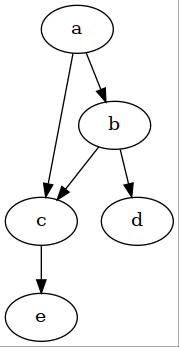
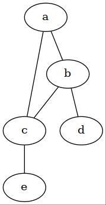

The chapter 2 of [Deep Learning Book](https://www.deeplearningbook.org/) is focussed on **Probability and
Information Theory.** This post is TLDR part 3 of the corresponding chapter of
the book.

## Background

- ML algorithms involve large number of random variables.
  - Joint Probability distribution of these many variables is complex.
  - Often, very few variables interact with each other directly.
  - Using joint probabilities to describe everything is inefficient.

- Alternative: Factorizing joint probabilities into conditionals of interacting variables.
  - Advantage: Less number of parameters
  - Efficient representation
  - Can be represented as graphs called: **graphical models**

$$p(a,b,c) = p(z) p(b \ \vert a) p(c \ \vert b)$$

- **Recall:** Graphs: set of vertices connected to each other with edges.
  - A graph $G$ with set of vertices $V$ and edges $V_{i,j}$
  - Can be *directed* or *undirected*.

- Probabilities can be represented as graphs: directed or undirected.
  - Each node corresponds to a random variable.
  - Edges between nodes represent the direct interaction between the random
    variables represented by those nodes.

---

## Directed Graph models

- Graphs with directed edges
- They represent factorizations into conditional probabilities
- Contains one factor for every random variable $x_i$ in the distribution (one
  vertrex for each random variable)
- That factor consists of conditional distribution for over $x_i$ given parents
  of $x_i$ denoted as: $P_{a_G}(x_i)$

  $$p(\mathbf{x}) = \underset{i}{\operatorname{\prod}}
  \ {p(x _i \ \vert \ P_{a_G}(x_i))}$$

- Example:

In the above directed graph, the joint probability of random variables:
$a,b,c,d,e$ can be written as:

$$p(a,b,c,d,e) = p(a) p(b \vert a) p(c \vert a, b) p(d \vert b) p(e \vert c)$$

---

## Undirected Graph models

- Factorize joint into functions, instead of conditionals.
- Set of nodes connected to each other in graph $G$ is called *clique*
- Each clique $C^{(i)}$ is associated with a factor $\phi^{(i)}(C^{(i)})$
- These factors are functions and not probabilities.
- Output of these functions must be non-negative.
  - If they were probabilities as in *directed*, they would also integrate to 1.
- Probability of any configuration is proportional to product of all these factors.
  - The proportanility is converted to equality by a normalizing constant that
    ensures that the total probability sums to one.

$$p(\mathbf{x}) = \frac{1}{Z} \underset{i}{\prod} \phi^{(i)}(C^{(i)})$$

- Example:

In the above undirected graph, the joint probability of random variables:
$a,b,c,d,e$ can be written as:

$$p(a,b,c,d,e) = \frac{1}{Z} \phi^{(1)}(a,b,c) \phi^{(2)}(b,d) \phi^{(3)}(c, e)$$

---

## Notes

- Graphical models are just different ways of representing the probability representations.
- The choise of method is not mutually exhaustive: different representations can
  be used for representing the same thing in different ways.
- Same probability distribution can be represented as directed as well as
  undirected depending on the situation.

---
